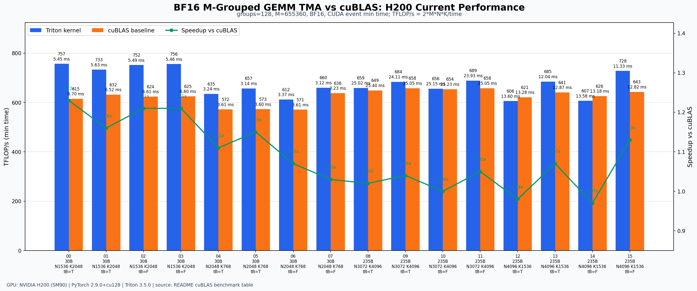
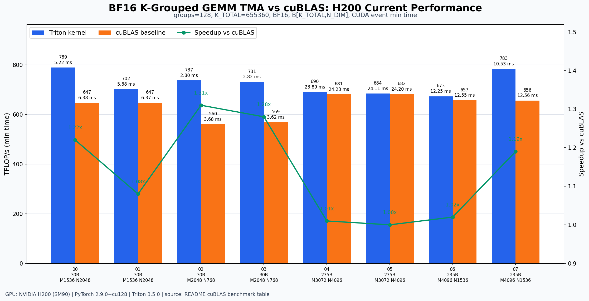

# Grouped GEMM Implementation using Triton
This repository provides optimized implementations of grouped GEMM using Triton. The implementations are categorized by data type: bfloat16 and FP8. Each implementation includes unit test that can be run directly from the python scripts.

## Features
- Optimized grouped GEMM implementations for BF16 and FP8 data types
- Support for different grouping strategies (M-Grouped and K_grouped)
- Various quantization schemes for FP8 implementations
- Included unit tests for verification
- Optional helper layer for DeepGEMM-compatible grouped layouts and backend selection

## Prerequisites

Before using this project, you need to install the benchmark CUDA Basic Linear Algebra Subroutines (cuBLAS) in the `grouped_gemm` subdirectory.

```bash
# 1. Navigate to the `grouped_gemm` directory:
cd grouped_gemm
# 2. Install the package using Python:
python setup.py install
```

## Backend Direction

This repository keeps Triton kernels as the default implementation. Recent SGLang and DeepGEMM changes are tracked as optional integration points rather than vendored code:

| Backend | Status in this repo | Intended hardware | Notes |
|---------|---------------------|-------------------|-------|
| Triton | Default | SM80+ for non-TMA, SM90+ for TMA files | Existing BF16/FP8 kernels continue to run through local Triton code. |
| DeepGEMM | Optional helper wrappers | SM90/SM100 | `gemm.deep_gemm_ops` imports `deep_gemm` only when called. Expert M segments must already be aligned for contiguous grouped GEMM. |
| CUTLASS benchmark | Reference/benchmark only | Depends on local build | Kept under `grouped_gemm/` and `benchmark/`; not used as the Python default. |

The helper modules are:

| Module | Purpose |
|--------|---------|
| `gemm.layout` | Builds logical/padded grouped starts and DeepGEMM group-id/psum layouts. |
| `gemm.backends` | Provides `auto`, `triton`, and `deep_gemm` backend selection helpers. |
| `gemm.deep_gemm_ops` | Thin optional wrappers for DeepGEMM BF16/FP8 contiguous grouped GEMM. |
| `gemm.tma` | Installs the Triton runtime allocator required by tensor descriptors. |

Example backend selection:

```python
from gemm.backends import select_backend

backend = select_backend("auto")
```

Example DeepGEMM layout creation:

```python
from gemm.layout import make_deep_gemm_grouped_layout

# Sizes describe actual rows; helper emits DeepGEMM's padded group-id layout.
grouped_layout = make_deep_gemm_grouped_layout(size_per_group, block_m=128)
```

## Triton 3.5 TMA

The SM90 TMA kernels use Triton 3.5 tensor descriptors:

- Kernel code uses `tl.make_tensor_descriptor(...).load(...)` and `.store(...)`.
- The old host-side descriptor helpers `fill_1d_tma_descriptor` and `fill_2d_tma_descriptor` are no longer used.
- TMA entrypoints call `gemm.tma.ensure_triton_tma_allocator()` before launch, because Triton tensor descriptors require a runtime allocator.

Validated smoke tests on H200/SM90:

| Path | Check |
|------|-------|
| `gemm/BF16/m_grouped_gemm_TMA.py` | `rdiff = 0.0` against torch reference |
| `gemm/BF16/m_grouped_gemm_masked_TMA.py` | `rdiff = 0.0` against torch reference |
| `gemm/BF16/k_grouped_gemm_TMA.py` | `rdiff = 0.0` against torch reference |
| `gemm/FP8/k_grouped_gemm_channel_expert.py` | output shape/finite smoke test |

## Current Test Results

BF16 TMA benchmark results below were regenerated on 2026-06-03 with an NVIDIA
H200/SM90 GPU. The baseline is `grouped_gemm_backend` cuBLAS. Timings use CUDA
events and report both min and average GPU time. TFLOP/s and speedup use the
minimum time:

```text
TFLOP/s = 2 * M * N * K / time_ms / 1e9
speedup = cuBLAS_min_ms / Triton_min_ms
```

### BF16 M-Grouped GEMM TMA vs cuBLAS

Command:

```bash
python gemm/BF16/m_grouped_gemm_TMA.py
```

`trans_b=True` uses `B[G,N,K]`; `trans_b=False` uses `B[G,K,N]`. Output layout is `C[M,N]`.



| Case | Model | n | k | M | trans_b | Layout | Triton min/avg ms | Triton TFLOP/s min/avg | cuBLAS min/avg ms | cuBLAS TFLOP/s | Speedup |
|------|-------|---|---|---|---------|--------|-------------------|------------------------|-------------------|----------------|---------|
| 00 | 30B | 1536 | 2048 | 655360 | True | B[G,N,K] | 5.45&nbsp;/&nbsp;5.79 | 757&nbsp;/&nbsp;712 | 6.70&nbsp;/&nbsp;6.77 | 615 | 1.23x |
| 01 | 30B | 1536 | 2048 | 655360 | True | B[G,N,K] | 5.63&nbsp;/&nbsp;5.87 | 733&nbsp;/&nbsp;702 | 6.52&nbsp;/&nbsp;6.60 | 632 | 1.16x |
| 02 | 30B | 1536 | 2048 | 655360 | False | B[G,K,N] | 5.49&nbsp;/&nbsp;6.18 | 752&nbsp;/&nbsp;667 | 6.61&nbsp;/&nbsp;6.77 | 624 | 1.21x |
| 03 | 30B | 1536 | 2048 | 655360 | False | B[G,K,N] | 5.46&nbsp;/&nbsp;5.99 | 756&nbsp;/&nbsp;688 | 6.60&nbsp;/&nbsp;6.72 | 625 | 1.21x |
| 04 | 30B | 2048 | 768 | 655360 | True | B[G,N,K] | 3.24&nbsp;/&nbsp;3.41 | 635&nbsp;/&nbsp;604 | 3.61&nbsp;/&nbsp;3.62 | 572 | 1.11x |
| 05 | 30B | 2048 | 768 | 655360 | True | B[G,N,K] | 3.14&nbsp;/&nbsp;3.14 | 657&nbsp;/&nbsp;656 | 3.60&nbsp;/&nbsp;3.63 | 573 | 1.15x |
| 06 | 30B | 2048 | 768 | 655360 | False | B[G,K,N] | 3.37&nbsp;/&nbsp;3.43 | 612&nbsp;/&nbsp;601 | 3.61&nbsp;/&nbsp;3.63 | 571 | 1.07x |
| 07 | 30B | 2048 | 768 | 655360 | False | B[G,K,N] | 3.12&nbsp;/&nbsp;3.13 | 660&nbsp;/&nbsp;659 | 3.23&nbsp;/&nbsp;3.53 | 638 | 1.03x |
| 08 | 235B | 3072 | 4096 | 655360 | True | B[G,N,K] | 25.02&nbsp;/&nbsp;25.37 | 659&nbsp;/&nbsp;650 | 25.40&nbsp;/&nbsp;25.64 | 649 | 1.02x |
| 09 | 235B | 3072 | 4096 | 655360 | True | B[G,N,K] | 24.11&nbsp;/&nbsp;24.23 | 684&nbsp;/&nbsp;681 | 25.05&nbsp;/&nbsp;25.09 | 658 | 1.04x |
| 10 | 235B | 3072 | 4096 | 655360 | False | B[G,K,N] | 25.15&nbsp;/&nbsp;25.38 | 656&nbsp;/&nbsp;650 | 25.23&nbsp;/&nbsp;25.76 | 654 | 1.00x |
| 11 | 235B | 3072 | 4096 | 655360 | False | B[G,K,N] | 23.93&nbsp;/&nbsp;24.26 | 689&nbsp;/&nbsp;680 | 25.05&nbsp;/&nbsp;25.11 | 658 | 1.05x |
| 12 | 235B | 4096 | 1536 | 655360 | True | B[G,N,K] | 13.60&nbsp;/&nbsp;13.97 | 606&nbsp;/&nbsp;590 | 13.28&nbsp;/&nbsp;13.47 | 621 | 0.98x |
| 13 | 235B | 4096 | 1536 | 655360 | True | B[G,N,K] | 12.04&nbsp;/&nbsp;12.81 | 685&nbsp;/&nbsp;644 | 12.87&nbsp;/&nbsp;12.92 | 641 | 1.07x |
| 14 | 235B | 4096 | 1536 | 655360 | False | B[G,K,N] | 13.58&nbsp;/&nbsp;13.72 | 607&nbsp;/&nbsp;601 | 13.18&nbsp;/&nbsp;13.35 | 626 | 0.97x |
| 15 | 235B | 4096 | 1536 | 655360 | False | B[G,K,N] | 11.33&nbsp;/&nbsp;12.67 | 728&nbsp;/&nbsp;651 | 12.82&nbsp;/&nbsp;12.89 | 643 | 1.13x |

### BF16 K-Grouped GEMM TMA vs cuBLAS

Command:

```bash
python gemm/BF16/k_grouped_gemm_TMA.py
```

This benchmark uses the fast `trans_b=False` layout: `A[K_TOTAL,M_DIM]`,
`B[K_TOTAL,N_DIM]`, `C[G,M_DIM,N_DIM]`.



| Case | Model | M_DIM | N_DIM | K_TOTAL | Layout | Triton min/avg ms | Triton TFLOP/s min/avg | cuBLAS min/avg ms | cuBLAS TFLOP/s | Speedup |
|------|-------|-------|-------|---------|--------|-------------------|------------------------|-------------------|----------------|---------|
| 00 | 30B | 1536 | 2048 | 655360 | B[K_TOTAL,N_DIM] | 5.22&nbsp;/&nbsp;5.52 | 789&nbsp;/&nbsp;748 | 6.38&nbsp;/&nbsp;6.63 | 647 | 1.22x |
| 01 | 30B | 1536 | 2048 | 655360 | B[K_TOTAL,N_DIM] | 5.88&nbsp;/&nbsp;5.90 | 702&nbsp;/&nbsp;699 | 6.37&nbsp;/&nbsp;6.46 | 647 | 1.08x |
| 02 | 30B | 2048 | 768 | 655360 | B[K_TOTAL,N_DIM] | 2.80&nbsp;/&nbsp;2.86 | 737&nbsp;/&nbsp;721 | 3.68&nbsp;/&nbsp;3.73 | 560 | 1.31x |
| 03 | 30B | 2048 | 768 | 655360 | B[K_TOTAL,N_DIM] | 2.82&nbsp;/&nbsp;2.98 | 731&nbsp;/&nbsp;691 | 3.62&nbsp;/&nbsp;3.79 | 569 | 1.28x |
| 04 | 235B | 3072 | 4096 | 655360 | B[K_TOTAL,N_DIM] | 23.89&nbsp;/&nbsp;24.31 | 690&nbsp;/&nbsp;678 | 24.23&nbsp;/&nbsp;24.87 | 681 | 1.01x |
| 05 | 235B | 3072 | 4096 | 655360 | B[K_TOTAL,N_DIM] | 24.11&nbsp;/&nbsp;24.23 | 684&nbsp;/&nbsp;681 | 24.20&nbsp;/&nbsp;24.38 | 682 | 1.00x |
| 06 | 235B | 4096 | 1536 | 655360 | B[K_TOTAL,N_DIM] | 12.25&nbsp;/&nbsp;12.77 | 673&nbsp;/&nbsp;646 | 12.55&nbsp;/&nbsp;12.63 | 657 | 1.02x |
| 07 | 235B | 4096 | 1536 | 655360 | B[K_TOTAL,N_DIM] | 10.53&nbsp;/&nbsp;11.96 | 783&nbsp;/&nbsp;690 | 12.56&nbsp;/&nbsp;12.62 | 656 | 1.19x |

The charts above are generated from the same cuBLAS benchmark data as the tables.

## BF16 Implementations

The following BF16 implementations are available in `gemm/BF16`:


| Script | Gemm Type |
|---------|---------|
|`m_grouped_gemm_masked_TMA.py` | M-Grouped Gemm with mask with cuda arch >= 90, Triton tensor descriptors | 
|`m_grouped_gemm_TMA.py` | M-Grouped Gemm with cuda arch >= 90, Triton tensor descriptors | 
|`k_grouped_gemm_TMA.py` | K-Grouped Gemm with cuda arch >= 90, Triton tensor descriptors | 
|`m_grouped_gemm.py` | M-Grouped Gemm with cuda arch >= 80 | 
|`k_grouped_gemm.py` | K-Grouped Gemm with cuda arch >= 80 | 

## FP8
The following FP8 implementations are available in `gemm/FP8/`:

| Script | Gemm Type | Quantization |
|---------|---------|---------|
|`m_grouped_gemm_channel_expert.py` | M-Grouped Gemm | Per-channel for activation, per-expert for weight  |
|`k_grouped_gemm_channel_expert.py` | K-Grouped Gemm |Per-channel for activation, per-expert for weight  |

The result of FP8 implementations
| Implementation                  | Max Relative Difference | Execution Time (ms) | Tflops |
|---------------------------------|-------------------------|---------------------|--------|
| m_grouped_gemm_channel_expert   | 0.058349609375          | 9.3 ms              | 442.0  |
| k_grouped_gemm_channel_expert   | 0.060546875             | 9.9 ms              | 646.0  |


### FP8 Update Notes

The current local FP8 kernels are still the per-channel/per-expert Triton path. For DeepGEMM/SGLang-style blockwise FP8, the next implementation boundary should be:

1. Use `quant/trans_per_block_quant_expand_128x.py` or a fused upstream quant kernel to produce 128-block scale layouts.
2. Convert scale tensors into the TMA-aligned layout required by the selected backend.
3. Call either the local Triton kernel or `gemm.deep_gemm_ops.m_grouped_fp8_nt_contiguous`.

Mega MoE is intentionally not added as a default path here. DeepGEMM's Mega MoE combines dispatch, two GEMMs, activation, and combine into a distributed fused kernel; it belongs in a serving/runtime integration layer rather than this standalone grouped GEMM package.
