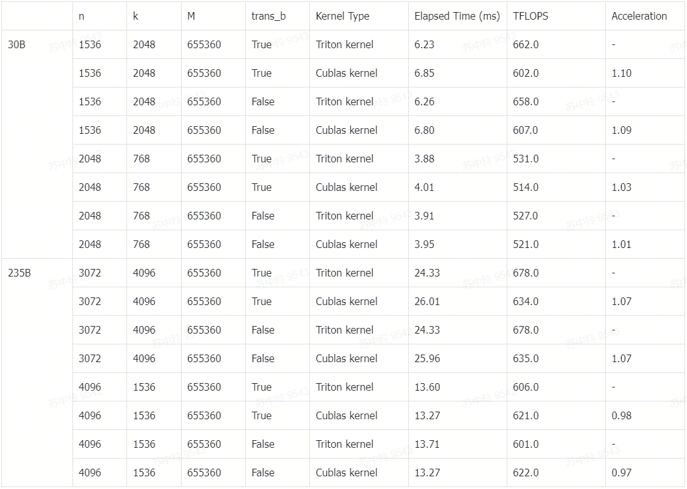
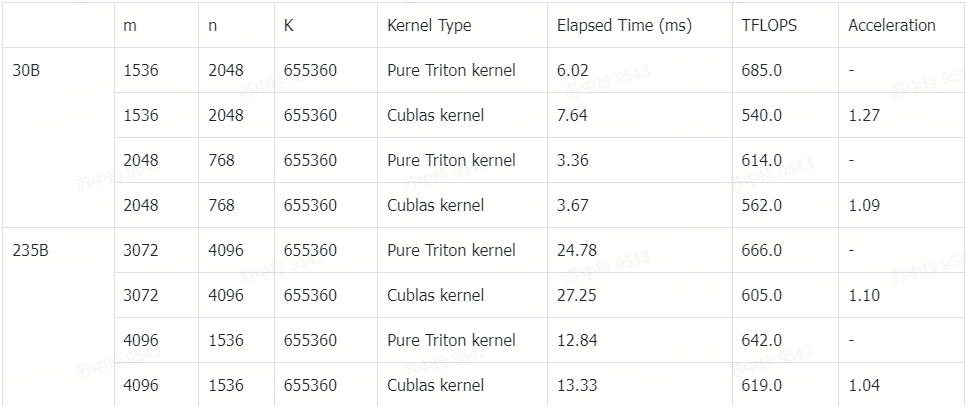
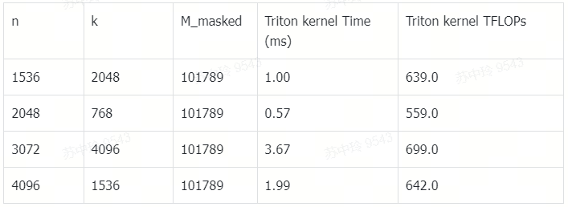

# Grouped GEMM Implementation using Triton
This repository provides optimized implementations of grouped GEMM using Triton. The implementations are categorized by data type: bfloat16 and FP8. Each implementation includes unit test that can be run directly from the python scripts.

## Features
- Optimized grouped GEMM implementations for BF16 and FP8 data types
- Support for different grouping strategies (M-Grouped and K_grouped)
- Various quantization schemes for FP8 implementations
- Included unit tests for varification

## BF16 Implementations

The following BF16 implementations are available in `gemm/BF16`:


| Script | Gemm Type |
|---------|---------|
|`m_grouped_gemm_masked_TMA.py` | M-Grouped Gemm with mask | 
|`m_grouped_gemm_TMA.py` | M-Grouped Gemm |
|`k_grouped_gemm_TMA.py` | K-Grouped Gemm |


### M-Grouped Gemm with TMA vs Benchmark
```python gemm/BF16/m_grouped_gemm_TMA.py```


### K-Grouped Gemm with TMA vs Benchmark
```python gemm/BF16/k_grouped_gemm_TMA.py```


### M-Grouped Gemm with mask
```python gemm/BF16/m_grouped_gemm_masked_TMA.py```



## FP8
The following FP8 implementations are available in `gemm/FP8/`:

| Script | Gemm Type | Quantization |
|---------|---------|---------|
|`m_grouped_gemm_channel_expert.py` | M-Grouped Gemm | Per-channel for activation, per-expert for weight  |
|`k_grouped_gemm_channel_expert.py` | K-Grouped Gemm |Per-channel for activation, per-expert for weight  |

The result of FP8 implementations
| Implementation                  | Max Relative Difference | Execution Time (ms) | Tflops |
|---------------------------------|-------------------------|---------------------|--------|
| m_grouped_gemm_channel_expert   | 0.058349609375          | 9.3 ms              | 442.0  |
| k_grouped_gemm_channel_expert   | 0.060546875             | 9.9 ms              | 646.0  |

### Additional Resources

For an alternative FP8 grouped GEMM that quantizes activation with 1x128 tile and weight with 128x128 block, please refer to:
https://github.com/sukoncon/TMA-Adaptive-FP8-Grouped-GEMM.